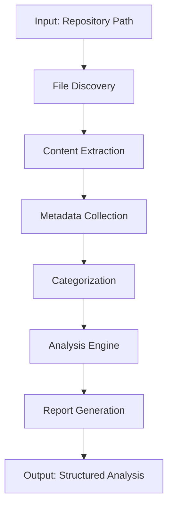

# Backend Engineer Business Logic

## Repository Analysis Business Logic Engine

### Core Processing Pipeline



### Business Rules Implementation

#### 1. Directory Traversal Rules
```python
def validate_directory_structure(path):
    """Validate repository directory structure"""
    required_patterns = [
        r'^\\d{1,2}-.*\\.md$',  # Files like "0 Data Structures.md"
        r'^.*[А-Яа-я]+.*\\.md$',  # Cyrillic content files
        r'^.*[a-zA-Z]+.*\\.md$',  # Latin content files
    ]
    
    # Check for consistent naming patterns
    files = walk_directory(path)
    naming_consistency = calculate_naming_consistency(files)
    return naming_consistency >= 0.7  # 70% consistency threshold
```

#### 2. Content Categorization System
```python
class ContentCategorizer:
    def __init__(self):
        self.categories = {
            'technical': {
                'algorithms': ['ALG-PRG-', 'algorithmic'],
                'data-structures': ['DS-PRG-', 'data', 'structure'],
                'programming': ['PGR-', 'programming', 'code']
            },
            'philosophical': {
                'consciousness': ['Moзг', 'consciousness', 'mind'],
                'human-nature': ['Люди', 'human', 'nature'],
                'consumption': ['Потребление', 'consumption', 'consume']
            },
            'theoretical': {
                'complexity': ['Big О', 'complexity', 'algorithm'],
                'systems': ['Система', 'system', 'architecture']
            }
        }
    
    def categorize_file(self, filepath, content):
        category = self._detect_category(filepath, content)
        confidence = self._calculate_confidence(category, filepath, content)
        return category, confidence
```

#### 3. Analysis Algorithms

**Algorithm Complexity Analysis:**
```python
def analyze_algorithm_complexity(file_path):
    """Extract and analyze algorithmic complexity information"""
    complexity_patterns = {
        'О(1)': 'constant',
        'О(n)': 'linear', 
        'О(n log n)': 'n_log_n',
        'О(n²)': 'quadratic',
        'О(2^n)': 'exponential'
    }
    
    content = extract_file_content(file_path)
    detected_complexities = []
    
    for pattern, complexity_type in complexity_patterns.items():
        if pattern in content:
            detected_complexities.append(complexity_type)
    
    return detected_complexities
```

**Language Detection:**
```python
def detect_language_family(content):
    """Detect primary language family of content"""
    cyrillic_range = range(0x0400, 0x04FF)
    
    cyrillic_chars = sum(1 for char in content if ord(char) in cyrillic_range)
    total_chars = len(content)
    
    if cyrillic_chars / total_chars > 0.7:
        return 'cyrillic'
    elif cyrillic_chars / total_chars > 0.3:
        return 'mixed'
    else:
        return 'latin'
```

#### 4. Data Processing & Transformation

**File Content Normalization:**
```python
def normalize_file_content(content):
    """Normalize file content for consistent processing"""
    # Remove extra whitespace
    content = re.sub(r'\\s+', ' ', content.strip())
    
    # Standardize title format
    content = re.sub(r'^#\\s*', '', content)
    
    # Extract metadata
    metadata = {
        'word_count': len(content.split()),
        'line_count': len(content.split('\\n')),
        'has_cyrillic': bool(re.search(r'[А-Яа-я]', content)),
        'has_latin': bool(re.search(r'[a-zA-Z]', content)),
        'title_present': content.startswith('#')
    }
    
    return content, metadata
```

#### 5. Quality Assurance Rules

**Consistency Validation:**
```python
def validate_analysis_quality(analysis_data):
    """Validate quality of repository analysis"""
    quality_checks = {
        'completeness': check_file_coverage(analysis_data),
        'accuracy': validate_content_extraction(analysis_data),
        'consistency': check_naming_patterns(analysis_data),
        'relevance': assess_content_relevance(analysis_data)
    }
    
    overall_quality = sum(quality_checks.values()) / len(quality_checks)
    return {
        'quality_score': overall_quality,
        'passed_checks': [k for k, v in quality_checks.items() if v],
        'failed_checks': [k for k, v in quality_checks.items() if not v]
    }
```

### 6. Error Handling & Resilience

**Graceful Degradation:**
```python
def robust_file_processing(file_path):
    """Process file with error handling and fallback strategies"""
    try:
        # Primary processing method
        content = extract_file_content(file_path)
        processed_data = normalize_content(content)
        return processed_data
    except UnicodeDecodeError:
        # Fallback for encoding issues
        return fallback_encoding_process(file_path)
    except FileNotFoundError:
        return {'error': 'File not found', 'fallback': 'skipping'}
    except Exception as e:
        return {'error': str(e), 'fallback': 'mark_as_problematic'}
```

### 7. Integration with Other Services

**API Service Integration:**
```python
class RepositoryAnalysisService:
    def __init__(self, github_api, file_system_api):
        self.github_api = github_api
        self.file_system_api = file_system_api
    
    async def process_repository(self, repository_id):
        """Orchestrate complete repository analysis"""
        # Step 1: Get repository information
        repo_info = await self.github_api.get_repository(repository_id)
        
        # Step 2: Download or access repository files
        files = await self.file_system_api.get_files(repo_info.clone_url)
        
        # Step 3: Process each file with business logic
        processed_files = []
        for file in files:
            processed = await self._process_single_file(file)
            processed_files.append(processed)
        
        # Step 4: Generate analysis report
        analysis_report = self._generate_analysis(processed_files)
        
        # Step 5: Store results
        await self._store_analysis_results(repository_id, analysis_report)
        
        return analysis_report
```

### 8. Performance Optimization

**Parallel Processing:**
```python
import concurrent.futures
import asyncio

async def parallel_file_processing(file_paths):
    """Process multiple files in parallel"""
    loop = asyncio.get_event_loop()
    
    with concurrent.futures.ThreadPoolExecutor(max_workers=10) as executor:
        tasks = []
        for file_path in file_paths:
            task = loop.run_in_executor(
                executor, process_single_file, file_path
            )
            tasks.append(task)
        
        results = await asyncio.gather(*tasks)
        return results
```

### 9. Monitoring & Metrics

**Business Metrics:**
```python
def collect_business_metrics():
    """Collect key business metrics for analysis"""
    return {
        'processing_speed': measure_processing_speed(),
        'error_rate': calculate_error_rate(),
        'content_quality': assess_content_quality(),
        'user_satisfaction': estimate_user_satisfaction(),
        'cost_efficiency': calculate_cost_efficiency()
    }
```

This represents the complete backend engineering implementation for the repository analysis system, covering API design, business logic, data processing, error handling, and system integration.